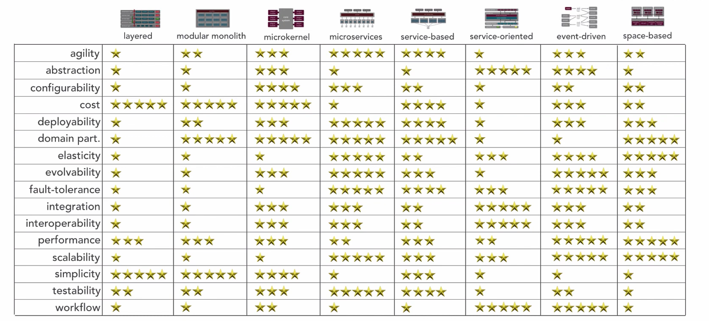

# Architecture Patterns

> #### sources :
>[Fundamentals of Software Architecture](https://www.oreilly.com/library/view/fundamentals-of-software/9781492043447/)

_The following are the most used/common architecture patterns :_

## 1. Layered pattern Architecture

This pattern can be used to structure programs that can be decomposed into groups of subtasks, each of which is at a
particular level of abstraction. Each layer provides services to the next higher layer. The most commonly found 4 layers
of a general information system are as follows -

* Presentation layer (also known as UI layer)
* Application layer (also known as service layer)
* Business logic layer (also known as domain layer)
* Data access layer (also known as persistence layer)

#### USAGE

* Desktop Applications
* E-commerce web applications etc.

## 2. Modular Monolith Architecture

Monolith is a system that has exactly one deployment unit. Modular Monolith architecture is an explicit name for a
Monolith system designed in a modular way. To achieve a high level of modularization each module must be independent,
has everything necessary to provide desired functionality (separation by business area), encapsulated and have a
well-defined interface/contract. The Modular Monolith architecture breaks up the code into independent modules for each
of the features needed in your application. Each module only link to other modules that specifically provides services
it needs.

## 3. Micro-kernel Architecture

The microkernel architecture pattern (sometimes referred to as the plug-in architecture pattern) is a natural pattern
for implementing product-based applications. A product-based application is one that is packaged and made available for
download in versions as a typical third-party product. However, many companies also develop and release their internal
business applications like software products, complete with versions, release notes, and pluggable features. These are
also a natural fit for this pattern. The microkernel architecture pattern allows you to add additional application
features as plug-ins to the core application, providing extensibility as well as feature separation and isolation.

The plug-in modules are stand-alone, independent components that contain specialized processing, additional features,
and custom code that is meant to enhance or extend the core system to produce additional business capabilities.
Generally, plug-in modules should be independent of other plug-in modules, but you can certainly design plug-ins that
require other plug-ins to be present. Either way, it is important to keep the communication between plug-ins to a
minimum to avoid dependency issues.

The core system needs to know about which plug-in modules are available and how to get to them. One common way of
implementing this is through some sort of plug-in registry. This registry contains information about each plug-in
module, including things like its name, data contract, and remote access protocol details (depending on how the plug-in
is connected to the core system).

Plug-in modules can be connected to the core system through a variety of ways, including OSGi (open service gateway
initiative), messaging, web services, or even direct point-to-point binding (i.e., object instantiation).

#### USAGE

* Eclipse
* Product based software
* Insurance softwares

## 3. Microservices Architecture

Microservice architecture – a variant of the service-oriented architecture (SOA) structural style – arranges an
application as a collection of loosely coupled services. In a microservices architecture, services are fine-grained and
the protocols are lightweight.

#### Benefits

The benefit of decomposing an application into different smaller services are numerous:

* **Modularity:** This makes the application easier to understand, develop, test, and become more resilient to
  architecture erosion.This benefit is often argued in comparison to the complexity of monolithic architectures
* **Scalability:** Since microservices are implemented and deployed independently of each other, i.e. they run within
  independent processes, they can be monitored and scaled independently.
* **Integration of heterogeneous and legacy systems:** microservices is considered as a viable means for modernizing
  existing monolithic software application. There are experience reports of several companies who have successfully
  replaced (parts of) their existing software by microservices, or are in the process of doing so. The process for
  Software modernization of legacy applications is done using an incremental approach.
* **Distributed development:** it parallelizes development by enabling small autonomous teams to develop, deploy and
  scale their respective services independently. It also allows the architecture of an individual service to emerge
  through continuous refactoring. Microservice-based architectures facilitate continuous integration, continuous
  delivery and deployment.

## 4. Service based Architecture

Service-based architectures consist of tens of deployable services, rather than the hundreds or thousands advocated by
microservice proponents. These services may have separate datastores, or may still share a single monolithic datastore.

Service-based architectures limit the number of network calls by grouping much larger chunks of code together by domain.
This should result in better performance. What might have been a call graph of a dozen related microservices becomes
method calls within a single service.

A service-based architecture provides more delivery speed than a monolith or service-oriented architecture (SOA) by
breaking the code apart in the domain-centric way advocated by microservice and DDD proponents

## 5. Service oriented Architecture

**Service-oriented architecture (SOA)** is an enterprise-wide approach to software development of application components
that takes advantage of reusable software components, or services. In SOA software architecture, each service comprises
the code and data integrations required to execute a specific business function — for example, checking a customer’s
credit, signing into a website or processing a mortgage application.

The service interfaces provide loose coupling, which means that they can be called with little or no knowledge of how
the integration is implemented underneath. Because of this loose coupling and the way the services are published,
development teams can save time by reusing components in other applications across the enterprise. This is both a
benefit and a risk. As a result of the shared access to the enterprise service bus (ESB), if issues arise, it can also
affect the other connected services.

XML data is a key ingredient for solutions that are based on SOA architecture. XML-based SOA applications can be used to
build web services, for example.

_SOA provides four different service types:_

* **Functional services**: (i.e., business services), which are critical for business applications.
* **Enterprise services**:  which serve to implement functionality.
* **Application services**:  which are used to develop and deploy apps.
* **Infrastructure services**:  which are instrumental for backend processes like security and authentication.

_Each service consists of three components:_

* **The interface**, which defines how a service provider will execute requests from a service consumer.
* **The contract**, which defines how the service provider and service consumer should interact.
* **The implementation**, which is the service code.

## 6. Event-Driven Architecture

Event-driven Architecture (EDA) is a software architecture paradigm promoting the production and consumption of events.
An event represents an action of significant interest. Often, events correspond to a creation, or a change of state of
some entity. For example, raising an order in an e-commerce application is an event. Dispatching a product as a result
of an earlier order is also an event. A customer submitting a review for a received product is an event.

### Benefits and Drawbacks :

### Event-driven architecture models

* **Pub/Sub Model** : This is a messaging infrastructure based on subscriptions to an event stream. With this model,
  after an event occurs, or is published, it is sent to subscribers that need to be informed.
* **Event streaming model** : With an event streaming model, events are written to a log. Event consumers don’t
  subscribe to an event stream. Instead, they can read from any part of the stream and can join the stream at any time.
  There are a few different types of event streaming:
    * **Event stream processing** uses a data streaming platform, like Apache Kafka, to ingest events and process or
      transform the event stream. Event stream processing can be used to detect meaningful patterns in event streams.
    * **Simple event processing** is when an event immediately triggers an action in the event consumer.
    * **Complex event processing** requires an event consumer to process a series of events in order to detect patterns.